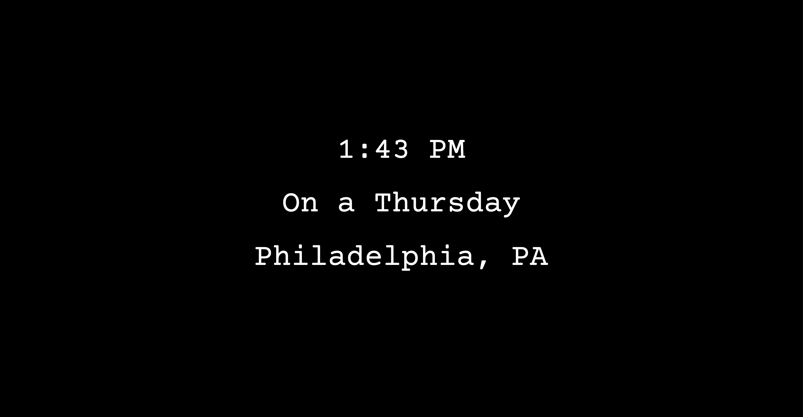

# always-sunny-web-clock
This is a web version of my [Always Sunny digital clock android app](https://github.com/KingYam/always-sunny-digital-clock).

it lives [here](https://always-sunny-clock.netlify.com/) for now.
